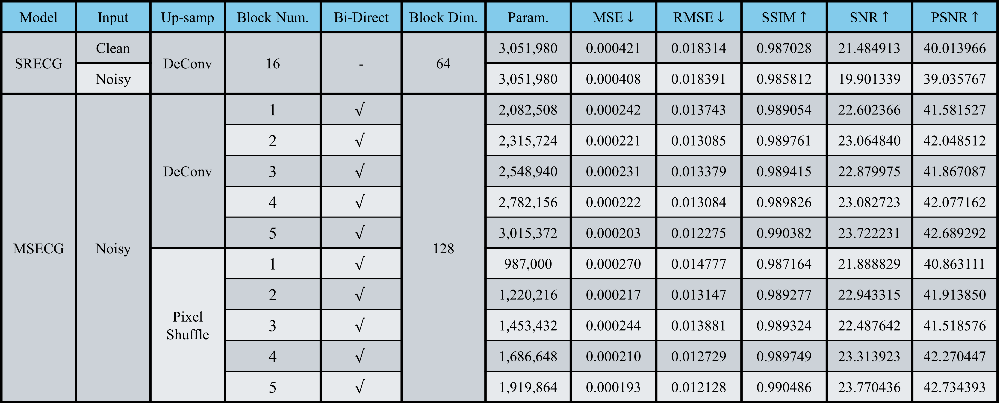

# MSECG

This is the official code of [MSECG: Incorporating Mamba for Robust and Efficient ECG Super-Resolution](https://ieeexplore.ieee.org/abstract/document/10890523?casa_token=vhFrJSK8WwQAAAAA:R3zaan7_P3akqfhDtNpt5D0PEZm9wLcxRCLky-PjQBN2eDKHF5CKEPR5Ot8b1xVgTmT7HfO4#full-text-header).
This network is based on a SR model of [SRECG: ECG Signal Super-resolution Framework for Portable/Wearable Devices in Cardiac Arrhythmias Classification](https://arxiv.org/abs/2012.03803).
We replace the Residual Blocks in the intermediate layers of SRECG with Mamba blocks.

## Introduction

The architecture of the SRECG is designed for Super-Resolution (SR) task, and the architecture is based on [SRResNet](https://arxiv.org/abs/1609.04802).

For now, we use [PTB-XL](https://physionet.org/content/ptb-xl/1.0.3/) dataset for the experiment. We also aggregate the noise dataset [MIT-BIH Noise Stress Test Database](https://physionet.org/content/nstdb/1.0.0/) with the clean PTB-XL dataset for training, ehancing the robustness of our MSECG.

For 500Hz high-resolution signals in the PTB-XL dataset, we first apply second-ordered 1Hz to 45Hz band-pass filters on them. Then, we down-sample filtered signals as well three different noises with 360Hz from the MIT-BIH noise dataset to 50Hz. We randomly combine low-resolution ECG signals and noise signals with random SNR and random start points to produce noisy LR inputs (50Hz).

For evaluation, we follow the metrics (MSE, RMSE, SSIM, SNR, and PSNR) in this paper [DCAE-SR: Design of a Denoising Convolutional Autoencoder for reconstructing Electrocardiograms signals at Super Resolution](https://arxiv.org/abs/2404.15307).

## Data pre-processing

    500Hz signals ── Band-pass Filter ──> clean HR (GT)
                            |
                      Down-sampling
                            |
                       50Hz signals
                            ├── 50% ──> no adding noises ──────┐
                            └── 50% ──> adding noises          |
                                              ├── 33.3% ──> bw ┤
                                              ├── 33.3% ──> em ┼── noisy inputs
                                              └── 33.3% ──> ma ┘
    

## Data layout

    MSECG
      ├── dataset_index
      │     ├── train.txt                       # Index for training dataset
      │     ├── val.txt                         # Index for validation dataset
      │     └── test.txt                        # Index for testing dataset
      │
      ├── model
      │     ├── model.py                        # Main architecture of MSECG
      │     └── parts.py                        # Modules adopted in the MSECG
      │
      ├── model_pth                             # Checkpoint file for the best performance
      │     └── MSECG-best.pth                  # You have to train your own checkpoint files
      │
      ├── sr_signal                             # Folder for SR signals
      │     ├── SR signal 1                     # You have to inference your own signals
      │     ├──     :
      │     └── SR signal N
      │
      ├── utils                                 # Store functional python files
      │     ├── dataloader.py                   # Methods how to load different datasets
      │     ├── generate_index.py               # Generate indexes for three datasets
      │     ├── loss_function.py                # Every loss function is here
      │     └── utils.py                        # Several useful functions
      │
      ├── train.py                              # Training process
      ├── inference.py                          # Inference process, results are stored in sr_signal
      ├── evaluate.py                           # Evaluate the performance between results and GT
      └── Train_Inference.sh                    # Scripting file through all process

## Usage
> It is recommended running the codes in virtual environments, such as [Anaconda](https://www.anaconda.com/download) or [Miniconda](https://docs.anaconda.com/miniconda/).

### ※ Training process:
- If you don't want to set training with arguments, you can modify the "default" section in train.py, and simply use
```
python train.py
```

- If regenerating the dataset index is necessary, you can specify the argument by
```
python train.py --regenerate_index True
```

- You should also modify the path to your dataset by
```
python train.py --dataset_dir '/path/to/dataset/' --noise_dir '/path/to/dataset/'
```

- The number of the input channel, the layer number of the Mamba block, and whether use bidirectional Mamba can be specified by
```
python train.py --mamba_in_ch 128 --n_layer 5 --bidirectional True
```

- Hyperparameters, such as batch size, epoch, and down-sampling rate, can also be specified by
```
python train.py --batchsize 64 --epoch 350 --decay_epoch 300 --downsample_rate 10
```

- Training loss functions (mse/mse_mag/mse_com) and compress factor for the spectrogram can be specified by
```
python train.py --loss mse_mag --compress_factor 0.3
```

### ※ Inference process:
- SR signals will be stored in the 'sr_signal' folder
```
python inference.py
```

### ※ Evaluation process:
- Evaluate the performance by five evaluation metrics, you can use
```
python evaluate.py
```
Five scores will be stored in five different txt files.

## Performance


> $x_i \rightarrow$ predicted SR signal

> $y_i \rightarrow$ ground truth SR signal

> $MSE(x_{i},y_{i})=\dfrac{1}{N} \Sigma_{i=1}^{N} (x_i-y_i)^{2}$

> $RMSE(x_{i},y_{i})=\sqrt{MSE(x_{i},y_{i})}$

> $SSIM(x,y)=\dfrac{(2\mu_{x}\mu_{y}+C_{1})(2\sigma_{xy}+C_{2})}{(\mu_{x}^{2}+\mu_{y}^{2}+C_{1})(\sigma_{x}^{2}+\sigma_{y}^{2}+C_{2})}$

> $SNR(x_{i},y_{i})=10\cdot \log_{10}\left(\dfrac{\Sigma_{i=1}^{N}x_{i}^{2}}{\Sigma_{i=1}^{N}(x_{i}-y_{i})^{2}}\right)$

> $PSNR(x_{i},y_{i})=10\cdot \log_{10}\left( \dfrac{\left[\max(x_i)\right]^{2}}{MSE(x_{i},y_{i})}\right)$

## BibTeX
If you want to use this code, please cite this paper:
```bibtex
@article{chen2023srecg,
  title={SRECG: ECG Signal Super-Resolution Framework for Portable/Wearable Devices in Cardiac Arrhythmias Classification},
  author={Chen, Tsai-Min and Tsai, Yuan-Hong and Tseng, Huan-Hsin and Liu, Kai-Chun and Chen, Jhih-Yu and Huang, Chih-Han and Li, Guo-Yuan and Shen, Chun-Yen and Tsao, Yu},
  journal={IEEE Transactions on Consumer Electronics},
  volume={69},
  number={3},
  pages={250--260},
```
```bibtex
@inproceedings{lin2025msecg,
  title={MSECG: Incorporating Mamba for Robust and Efficient ECG Super-Resolution},
  author={Lin, Jie and Chiu, I and Wang, Kuan-Chen and Liu, Kai-Chun and Wang, Hsin-Min and Yeh, Ping-Cheng and Tsao, Yu},
  booktitle={ICASSP 2025-2025 IEEE International Conference on Acoustics, Speech and Signal Processing (ICASSP)},
  pages={1--5},
  year={2025},
  organization={IEEE}
}
```
